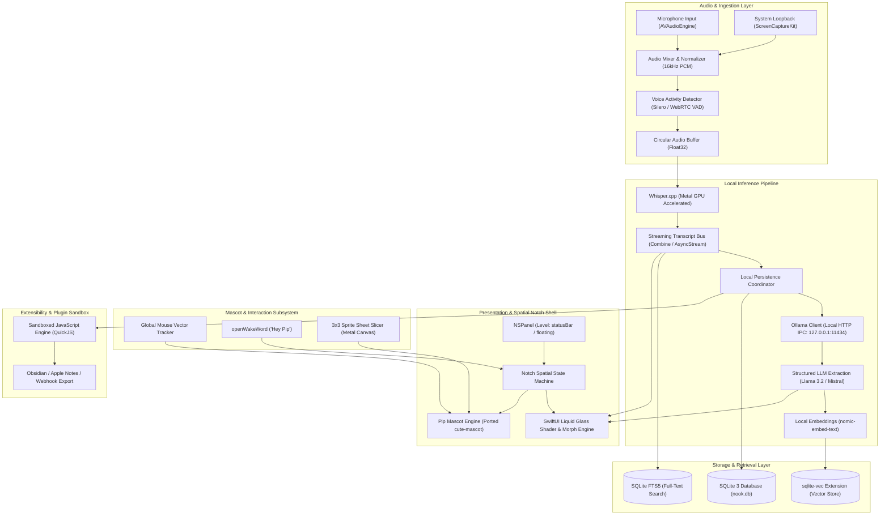

# System Architecture (ARCHITECTURE.md)
## Nook — The Invisible, Local-First AI Meeting Companion

**Document Version:** 1.0.0  
**Target Release:** Version 3.0  
**Status:** Approved / Technical Reference  
**Author:** Technical Architect & Systems Lead  

---

### 1. High-Level Architecture Overview

Nook is designed as a modular, local-first reactive system composed of six primary subsystems operating on local host hardware with zero cloud dependencies.



---

### 2. Component Breakdown

#### 2.1 Native Notch Shell (`NookNotchShell`)
- **Technology:** Swift 5.10 / SwiftUI + AppKit.
- **Window Implementation:** Subclassed `NSPanel` with style masks `.nonactivatingPanel` and `.borderless`.
- **Level Management:** Assigned `NSWindow.Level.statusBar` to render seamlessly above standard macOS desktop spaces, menus, and full-screen windows.
- **Display Snapping Logic:** Listens for `NSApplication.didChangeScreenParametersNotification`. Inspects `NSScreen.main.safeAreaInsets.top`. If `safeAreaInsets.top > 0` (hardware notch present), anchors origin at top-center bounding rect. If zero, defaults to floating island geometry with top margin.

#### 2.2 Audio Capture & Pipeline (`NookAudioCore`)
- **Microphone Stream:** `AVAudioEngine` tapping default system input at 16,000 Hz, 32-bit Float.
- **System Audio Stream:** Utilizes macOS 14+ `ScreenCaptureKit` `SCStream` capturing system-wide output audio without video.
- **Ring Buffer:** Thread-safe C++ circular lockless buffer capable of storing up to 60 seconds of rolling audio frames.
- **VAD Engine:** Segments audio into continuous human speech bursts; discards ambient silence to prevent Whisper hallucinations.

#### 2.3 Inference Engine (`NookInferenceCore`)
- **Whisper.cpp Engine:** Embedded C++ library compiled with `-DGGML_USE_METAL=1`. Swift bridge runs inference in dedicated high-priority GCD dispatch queues (`DispatchQueue(label: "ai.nook.whisper", qos: .userInitiated)`).
- **Ollama Client:** Asynchronous Swift HTTP client communicating via `URLSession` over Unix socket or `127.0.0.1:11434`. Handles streaming tokens and schema validation.

#### 2.4 Mascot Core (`PipMascotCore`)
- **Upstream Adaptation:** Implements `cute-mascot`'s mathematical angle discretization and directional frame selection.
- **Sprite Slicing:** Loads `directions.png` and `reactions.png` into GPU memory via Metal textures. Calculates sub-rect coordinates:
  $$\text{cellX} = (\text{frameIndex} \pmod 3) \times 128, \quad \text{cellY} = \lfloor\text{frameIndex} / 3\rfloor \times 128$$
- **Compositing:** Uses SwiftUI `Canvas` with `.drawingGroup()` or Metal fragment shaders to composite Pip base sprites with active outfit accessory masks.

#### 2.5 Storage & Semantic Retrieval Engine (`NookStorageCore`)
- **Database Engine:** Embedded SQLite 3 with WAL (Write-Ahead Logging) enabled.
- **Vector Search:** `sqlite-vec` extension provides KNN vector indexation for 384-dimensional or 768-dimensional embeddings.
- **Hybrid Search:** Combines FTS5 BM25 text match ranking with cosine distance calculations.

---

### 3. Detailed Data Flow

```
1. Audio Hardware Event 
   --> CoreAudio / SCStream callback receives PCM Buffer
   --> Ring Buffer pushes Float32 frames
   --> VAD triggers speech start marker

2. Real-Time Transcription
   --> Audio buffer slice (3-second window) dispatched to Whisper.cpp
   --> Metal GPU generates text tokens + timestamps
   --> Live token emitted to Combine Publisher
   --> Notch UI renders streaming text in active wing

3. Post-Meeting Synthesis
   --> User ends recording (or meeting window closes)
   --> Full transcript concatenated from SQLite session records
   --> Asynchronous POST request sent to Ollama `/api/generate` with strict JSON prompt
   --> Ollama yields Executive Summary, Action Items, and Topic Tags
   --> SQLite updates session status to 'synthesized'

4. Knowledge Embedding & Action Items
   --> Summary & key turns chunked into 512-token segments
   --> Ollama `/api/embeddings` calculates vectors
   --> Vectors inserted into `meeting_embeddings` via `sqlite-vec`
   --> Action items parsed and inserted into `action_items` table
   --> Pip triggers celebration animation and notifies user
```

---

### 4. Storage Schema Overview (SQLite DDL)

```sql
-- SQLite Database Schema: nook.db
PRAGMA journal_mode = WAL;
PRAGMA foreign_keys = ON;

-- 1. Meetings Table
CREATE TABLE IF NOT EXISTS meetings (
    id TEXT PRIMARY KEY NOT NULL,              -- UUID v4
    title TEXT NOT NULL,                       -- Auto-generated or user-edited
    template_type TEXT DEFAULT 'general',      -- '1-on-1', 'standup', 'design', etc.
    started_at INTEGER NOT NULL,               -- Unix epoch timestamp (ms)
    ended_at INTEGER,                          -- Unix epoch timestamp (ms)
    duration_seconds INTEGER DEFAULT 0,
    audio_path TEXT,                           -- Relative path to encrypted audio
    executive_summary TEXT,                    -- Markdown summary from LLM
    sentiment_score REAL DEFAULT 0.0,          -- Overall meeting energy/sentiment
    created_at INTEGER NOT NULL DEFAULT (strftime('%s', 'now'))
);

-- 2. Transcripts Table
CREATE TABLE IF NOT EXISTS transcripts (
    id TEXT PRIMARY KEY NOT NULL,              -- UUID v4
    meeting_id TEXT NOT NULL REFERENCES meetings(id) ON DELETE CASCADE,
    speaker_tag TEXT NOT NULL,                 -- 'host', 'remote_speaker', or custom name
    start_ms INTEGER NOT NULL,                 -- Timestamp offset from start
    end_ms INTEGER NOT NULL,
    text_content TEXT NOT NULL,
    confidence REAL DEFAULT 1.0,
    created_at INTEGER NOT NULL DEFAULT (strftime('%s', 'now'))
);
CREATE INDEX IF NOT EXISTS idx_transcripts_meeting ON transcripts(meeting_id);

-- 3. Full-Text Search Virtual Table
CREATE VIRTUAL TABLE IF NOT EXISTS transcripts_fts USING fts5(
    text_content,
    content='transcripts',
    content_rowid='rowid'
);

-- 4. Action Items Table
CREATE TABLE IF NOT EXISTS action_items (
    id TEXT PRIMARY KEY NOT NULL,              -- UUID v4
    meeting_id TEXT NOT NULL REFERENCES meetings(id) ON DELETE CASCADE,
    task_description TEXT NOT NULL,
    assignee TEXT DEFAULT 'You',
    due_date TEXT,                             -- ISO 8601 string or natural date
    priority TEXT DEFAULT 'medium',            -- 'low', 'medium', 'high', 'urgent'
    status TEXT DEFAULT 'pending',             -- 'pending', 'in_progress', 'completed'
    completed_at INTEGER,
    created_at INTEGER NOT NULL DEFAULT (strftime('%s', 'now'))
);
CREATE INDEX IF NOT EXISTS idx_action_items_status ON action_items(status);

-- 5. Semantic Vector Embeddings Table (via sqlite-vec)
CREATE VIRTUAL TABLE IF NOT EXISTS meeting_vectors USING vec0(
    embedding_id TEXT PRIMARY KEY,
    meeting_id TEXT,
    chunk_text TEXT,
    embedding float[768]                       -- Matching nomic-embed-text dimensionality
);

-- 6. Pip Mascot Outfits & Cosmetics Table
CREATE TABLE IF NOT EXISTS pip_outfits (
    id TEXT PRIMARY KEY NOT NULL,
    name TEXT NOT NULL,
    is_equipped INTEGER DEFAULT 0,
    unlocked_at INTEGER NOT NULL DEFAULT (strftime('%s', 'now'))
);

-- 7. App Configuration Table
CREATE TABLE IF NOT EXISTS app_settings (
    key TEXT PRIMARY KEY NOT NULL,
    value TEXT NOT NULL,
    updated_at INTEGER NOT NULL DEFAULT (strftime('%s', 'now'))
);
```

---

### 5. Local AI Pipeline Architecture

#### 5.1 Transcription Prompt & Context Injection
Whisper.cpp is primed with an application context prefix containing user-defined keywords, company jargon, and teammate names extracted from previous meetings to minimize domain-specific transcription errors:
```c
struct whisper_full_params params = whisper_full_default_params(WHISPER_SAMPLING_GREEDY);
params.initial_prompt = "Nook, meeting, engineering, sprint, backlog, architecture, Pip.";
params.n_threads = 4;
params.translate = false;
params.no_context = false;
```

#### 5.2 Deterministic LLM Structured Synthesis Prompt
```text
SYSTEM PROMPT:
You are Pip, an expert executive secretary and note synthesizer. Analyze the meeting transcript below and produce a strictly valid JSON response adhering to this schema:

{
  "title": "Concise 4-8 word meeting title",
  "executive_summary": "1-3 paragraphs summarizing context, core discussions, and outcomes.",
  "key_decisions": ["Decision 1", "Decision 2"],
  "action_items": [
    {
      "task": "Explicit actionable task",
      "owner": "Name of assigned individual or 'Unassigned'",
      "due_date": "YYYY-MM-DD or 'None'",
      "priority": "low | medium | high | urgent"
    }
  ],
  "topics_discussed": ["Topic 1", "Topic 2"]
}

Do not include any conversational filler, markdown formatting tags, or preambles. Output pure JSON only.
```

---

### 6. Local Plugin Execution Engine

To preserve stability and security while allowing local extensibility, Nook embeds a sandboxed JavaScript runtime (QuickJS):
- **Execution Boundary:** No filesystem access outside of dedicated export directories; no network access (`fetch` and `XMLHttpRequest` are completely omitted from the sandbox context).
- **Available APIs:**
  - `console.log(...args)`: Emits to local debug log file.
  - `nook.writeMarkdown(path, content)`: Writes generated note to allowed user directories (e.g., Obsidian vault).
  - `nook.notifyUser(title, body)`: Triggers native macOS notification.
- **Hook Lifecycle:**
  - `onSessionStart(session)`
  - `onTranscriptChunk(chunk)`
  - `onMeetingEnd(summary, actionItems)`
