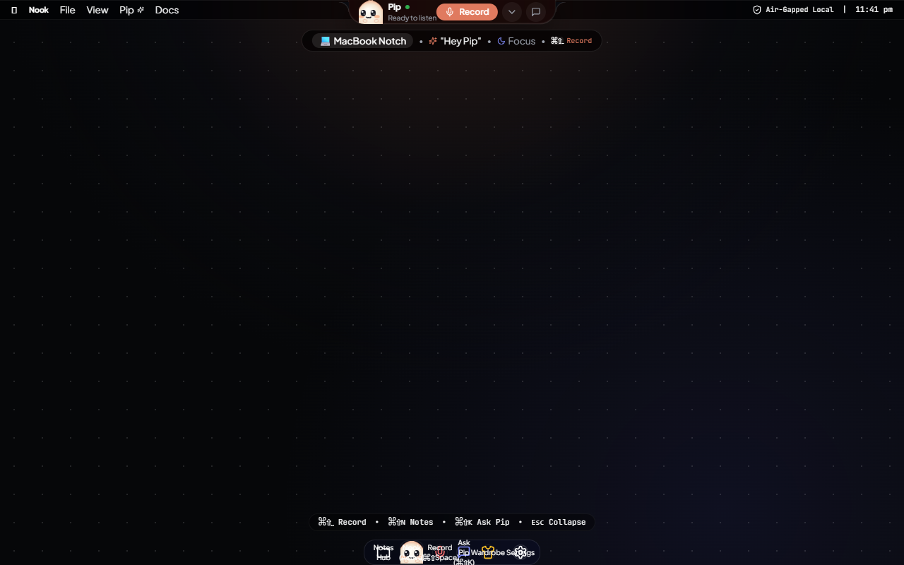

# 🥟 Nook (Piko) — The Invisible, Local-First AI Meeting Companion

<div align="center">



[]()
[]()
[]()
[]()
[]()
[]()

**A spatial desktop companion living seamlessly inside your MacBook notch or Windows Dynamic Island.**  
*100% offline speech recognition, local meeting intelligence, persistent action items, and 65 interactive mascots.*

[Features](#-key-features) • [Installation](#-installation--setup) • [Building](#-build-for-macos--windows) • [Mascot Roster](#-65-cute-mascot-characters) • [Voice Commands](#-local-voice-commands) • [Shortcuts](#-shortcuts--gestures) • [Privacy](#-privacy--security-architecture)

</div>

---

## 🌟 Overview

**Nook** (also known as **Piko**) fundamentally rethinks meeting intelligence. Instead of awkward cloud bots joining your Zoom/Meet/Teams calls or bulky windows cluttering your workspace, Nook lives **invisibly docked into your display bezel**.

When you need it, Nook glides open into an expansive liquid-glass HUD. When idle, it collapses flush into your screen bezel, accompanied by **Pip** (and 64 other cute companions) who keep watch over your pending action items and respond with lifelike physics, eye tracking, and joyful micro-animations.

All audio transcription, speaker diarization, synthesis, vector search, and note persistence happen **entirely on your local machine**. Not a single packet ever leaves your computer.

---

## ✨ Key Features

### 1. 🪟 Spatial Notch Architecture (macOS & Windows)
- **MacBook Bezel Mode:** Docks flush against the top display bezel with mathematically exact **concave G2 Bezier fillet ear SVGs** (`14px`) and liquid specular sheen.
- **Windows Dynamic Island Mode:** Floats as a symmetrical pill with continuous 360° curvature and smooth spring physics.
- **Emil Kowalski Animation Physics:** Fluid state transitions between **Collapsed** (`160px`), **Compact** (`368px`), **Recording Wings** (`500px`), **Drawer** (`700px`), and **Chat Flyout** (`540px`).

### 2. 🛡️ 100% Offline AI & Zero Telemetry
- **Local Speech-to-Text:** Real-time speech transcription via local Whisper.cpp / browser speech engines with zero external API calls.
- **Local LLM Synthesis:** Executive summaries, key decisions, and critical action items extracted by local Ollama (`llama3.2`, `qwen2.5`, `mistral`, or `deepseek-r1`).
- **Zero Cloud Meeting Bots:** Records loopback audio and microphone locally—no uninvited bots showing up on your client calls.

### 3. 🎭 65 Cute Mascot Characters & Wardrobe Studio
- Complete roster inspired by the open-source `cute-mascot` system:
  - **Classics:** Pip (Dumpling), Kiko (Fox), Milo (Cat), Boba (Frog), Nori (Penguin), Aero (Robot), Nova (Bunny).
  - **Diverse Cast (65+):** Ballerina, Astronaut, Afro, Bear, Bee, Cactus, Chick, Cloud, Dino, Duck, Ghost, Mushroom, Ninja, Owl, Panda, Puppy, Shark, Wizard, and more!
- **High-DPI 3×3 Sprite Animation Engine:** Real-time eye tracking cursor movement, squishy spring physics, idle breathing bobs, and emotional reactions (`idle`, `listening`, `celebrating`, `thinking`, `alert`, `sleeping`).
- **Interactive Boop:** Click any mascot for instant tactile audio-visual joy; double-click to access the wardrobe.
- **Active Abilities:**
  - 🎯 **Action Item Hunter (Pip):** Scans discussions and synthesizes urgent follow-ups.
  - ⚡ **Zero-Telemetry Sentinel (Aero / Bots):** Guards mic and local storage.
  - 🤝 **Colleague Co-Pilot (Ballerina / People):** Tags assignments to meeting participants.
  - 🐾 **Calm Heartbeat (Kiko / Animals):** Soothing audio purrs during intense calls.
  - 📜 **Obsidian Origami (Paper):** Formats transcripts into structured markdown callouts.

### 4. 🧠 Multi-Meeting Memory & Cross-Meeting Chat
- **Memory Switcher:** Browse and switch between recent meetings directly inside the notch.
- **"Continue from Last Meeting" Banner:** Contextual continuity connecting related discussions.
- **Cross-Meeting Semantic Search:** Ask Pip questions across all historical meetings with exact timestamp citations.
- **Meeting Health & Soft Score:** Action clarity rating, talk-time balance, and sentiment analysis.

### 5. ✅ Smart Persistent Action Items
- Tasks stay alive across sessions until explicitly checked off.
- Compact notch indicator displays remaining commitments (`🎯 3 open tasks`).
- Confetti celebration and chime audio when completing items.

### 6. 🎙️ Local Voice Commands & Wake Word
- Always-on local wake-word engine:
  - *"Hey Pip, start meeting"* → Starts loopback capture.
  - *"Hey Pip, summarize"* → Ends meeting and generates instant notes.
  - *"Hey Pip, what were the action items?"* → Reads pending follow-ups.
  - *"Hey Pip, focus mode"* → Collapses into tiny non-intrusive pill.

### 7. 📋 7 Specialized Meeting Templates
- **Standup** (Blockers, sprint progress, quick sync)
- **1:1 Sync** (Feedback, career growth, personal goals)
- **Client Call** (Deliverables, stakeholder approvals, deadlines)
- **Brainstorm** (Raw concepts, divergent ideas, voting)
- **Interview** (Candidate competencies, strengths, flags)
- **Executive Review** (KPIs, roadmaps, strategic decisions)
- **Technical Architecture** (RFC decisions, API specs, performance)

### 8. 📊 Visual Timeline & Talk-Time Diarization
- Interactive horizontal timeline scrubber with waveform energy bars.
- Visual Pip mascot playhead tracking playback position.
- Speaker talk-time distribution (Speaker 1 vs Speaker 2 percentage).

### 9. 🔌 Obsidian, Todo.txt & Drag-and-Drop Ingestion
- **Obsidian Vault Sync:** Automatically exports markdown notes with tags, frontmatter, and callouts to your local vault.
- **Todo.txt Sync:** Writes tasks formatted with priorities (`(A)`) and project tags (`+meeting`).
- **Drag-and-Drop Audio Import:** Drop any external `.wav`, `.mp3`, or `.m4a` file directly onto the notch for immediate transcription.

---

## 🚀 Installation & Setup

### Requirements
- **macOS:** macOS 12 Monterey, 13 Ventura, 14 Sonoma, or 15 Sequoia (Apple Silicon M1/M2/M3/M4 & Intel).
- **Windows:** Windows 10 or Windows 11 (64-bit).
- **Node.js:** v18.0.0 or later (for source development).

---

### Download Pre-Built Binaries

Pre-packaged releases are available under GitHub Releases:
- **Windows:** Download `Nook-Setup-3.0.0.exe` or standalone `Nook-3.0.0-Portable.exe`.
- **macOS:** Download `Nook-3.0.0-mac.zip`, unzip, and move `Nook.app` to your `/Applications` folder.

---

### Running from Source

```bash
# 1. Clone the repository
git clone https://github.com/shivbu22/piko.git
cd piko

# 2. Install dependencies
npm install

# 3. Start local development server
npm run dev

# 4. In another terminal, launch the Electron desktop shell
npm run desktop:start
```

---

## 🛠️ Build for macOS & Windows

Nook is packaged with **Electron Builder**:

```bash
# Build for Windows (generates NSIS installer & Portable executable in release/)
npm run desktop:build:win

# Build for macOS (generates zipped .app bundle in release/)
npm run desktop:build:mac

# Build for both platforms
npm run desktop:build:all
```

Outputs will be generated inside the `./release/` directory:
- `release/Nook-Setup-3.0.0.exe` (Windows NSIS Installer)
- `release/Nook-3.0.0-Portable.exe` (Windows Portable)
- `release/Nook-3.0.0-mac.zip` (macOS Universal Bundle)

---

## 🤖 Local AI Configuration (Ollama & Whisper)

To achieve 100% offline intelligence:

1. **Install Ollama:**
   - macOS: `brew install ollama`
   - Windows: Download from [ollama.ai](https://ollama.ai)

2. **Pull your preferred local model:**
   ```bash
   ollama run llama3.2
   # or
   ollama run qwen2.5:3b
   # or
   ollama run mistral
   ```

3. **Verify Ollama is running:**
   Nook automatically connects to `http://localhost:11434`. In Nook settings, select your installed model name.

---

## ⌨️ Shortcuts & Gestures

| Action | Shortcut | Gesture |
| :--- | :--- | :--- |
| **Toggle Recording** | `Cmd/Ctrl + Shift + Space` | **Swipe Up** on notch |
| **Open Notes Drawer** | `Cmd/Ctrl + Shift + N` | **Swipe Down** / **Scroll Wheel Down** |
| **Ask Mascot (Chat)** | `Cmd/Ctrl + Shift + K` | Click `Ask Mascot` icon |
| **Mascot Studio** | Click Shirt icon | Double-click Mascot avatar |
| **Boop Mascot** | Single Click Mascot | Long-press (500ms) on notch |
| **Focus Mode** | Click Moon/Focus button | Collapses to compact pill |
| **Switch Notch Mode** | Available in Settings | Toggle Hardware Notch / Dynamic Island |

---

## 🎨 65 Cute Mascot Characters

Access the **Mascot Studio** anytime by clicking the pink wardrobe button (`Shirt`) in the compact notch or pressing `Cmd+Shift+N`.

| Category | Sample Characters | Ability |
| :--- | :--- | :--- |
| **Classics** | Pip (Dumpling), Milo (Cat), Kiko (Fox), Boba (Frog), Nori (Penguin), Aero (Robot), Nova (Bunny) | Core meeting companions with reactive expressions |
| **Animals** | Bear, Bee, Chick, Cow, Dino, Dog, Duck, Koala, Owl, Panda, Puppy, Shark, Whale, Pig | Calm Heartbeat & soothing sound feedback |
| **Bots** | Aero, Android, Cyborg, Mech, Robo, Byte, Spark | Zero-Telemetry Sentinel guarding system privacy |
| **People** | Ballerina, Astronaut, Ninja, Chef, Wizard, Detective, Gamer, Superhero, Pirate | Colleague Co-Pilot tagging participants to tasks |
| **Paper / Misc** | Origami Swan, Cactus, Cloud, Ghost, Mushroom, Star | Obsidian Origami formatting structured callouts |

---

## 🔒 Privacy & Security Architecture

- **Zero Outbound Sockets:** Nook contains zero analytic SDKs, zero telemetry endpoints, and zero cloud tracking pixels.
- **Local Storage:** All transcripts, action items, audio waveforms, and mascot settings reside in standard browser local storage and local SQLite on your own drive.
- **Open Data:** Export your data at any time in plain Markdown (`.md`) or standard JSON.

---

## 📂 Project Structure

```text
Piko/
├── electron/
│   ├── main.cjs            # Electron main process (always-on-top bezel window)
│   └── preload.cjs         # Context-isolated IPC bridge & global hotkeys
├── src/
│   ├── ai/
│   │   ├── OllamaEngine.ts     # Local LLM integration & prompt templates
│   │   ├── SegmentClassifier.ts# Real-time sentence classification & highlighting
│   │   └── templates.ts        # 7 specialized meeting synthesis templates
│   ├── audio/
│   │   ├── AudioEngine.ts      # Web Audio API loopback & mic capture
│   │   ├── SoundEffects.ts     # 10 custom WAV audio tactile sound effects
│   │   └── WakeWordEngine.ts   # Offline local wake-word detection ("Hey Pip")
│   ├── components/
│   │   ├── NotchShell.tsx      # Spatial liquid-glass notch HUD & hardware ear fillets
│   │   ├── MascotStudio.tsx    # 65-character wardrobe & ability studio
│   │   ├── FullDrawer.tsx      # Meeting notes, visual timeline & action items
│   │   ├── ChatFlyout.tsx      # Cross-meeting semantic query flyout
│   │   ├── WaveformVisualizer.ts # Real-time canvas audio frequency visualizer
│   │   └── SettingsModal.tsx   # Model selection & display mode configuration
│   ├── mascot/
│   │   ├── PipCanvas.tsx       # High-DPI 3x3 sprite sheet animation renderer
│   │   ├── PipEngine.ts        # Eye tracking & squishy spring physics
│   │   └── characters.ts       # Mascot roster metadata, palettes & abilities
│   ├── plugins/
│   │   └── PluginEngine.ts     # Obsidian vault export & Todo.txt integration
│   ├── storage/
│   │   └── StorageEngine.ts    # Local persistence & action item state machine
│   └── types/
│       └── index.ts            # TypeScript definitions
├── dist/characters/            # 65 character folders with 3x3 sprite sheets
├── dist/sounds/                # 10 tactile sound effect assets
├── package.json
└── vite.config.ts
```

---

## 📄 License

Distributed under the **MIT License**. See `LICENSE` for more information.

---

<div align="center">
Crafted with 🥟 and care for deep-focus knowledge workers everywhere.
</div>
